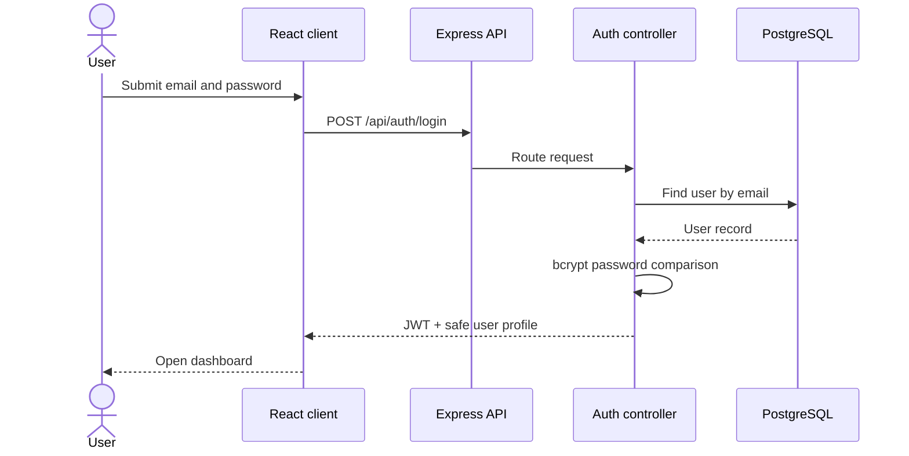
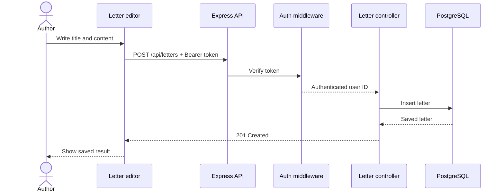
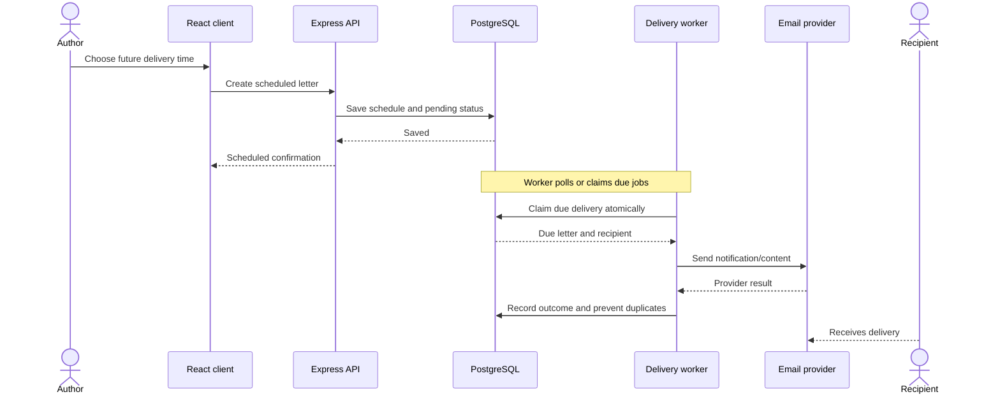
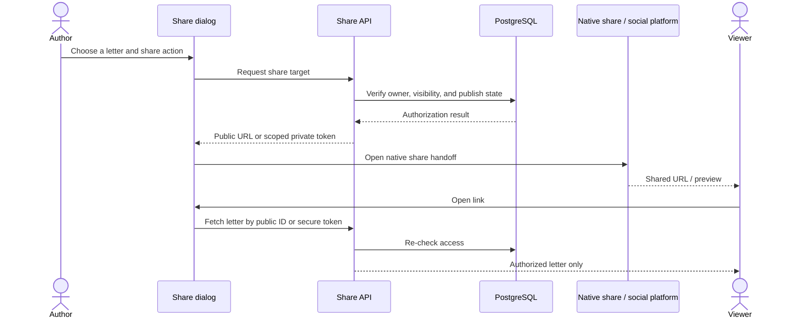

# Sequence Diagrams

## Login (current implementation)

```mermaid
sequenceDiagram
  actor User
  participant UI as React client
  participant API as Express API
  participant Auth as Auth controller
  participant DB as PostgreSQL

  User->>UI: Submit email and password
  UI->>API: POST /api/auth/login
  API->>Auth: Route request
  Auth->>DB: Find user by email
  DB-->>Auth: User record
  Auth->>Auth: bcrypt password comparison
  Auth-->>UI: JWT + safe user profile
  UI-->>User: Open dashboard
```

## Letter creation (current implementation)

```mermaid
sequenceDiagram
  actor Author
  participant UI as Letter editor
  participant API as Express API
  participant JWT as Auth middleware
  participant Controller as Letter controller
  participant DB as PostgreSQL

  Author->>UI: Write title and content
  UI->>API: POST /api/letters + Bearer token
  API->>JWT: Verify token
  JWT-->>Controller: Authenticated user ID
  Controller->>DB: Insert letter
  DB-->>Controller: Saved letter
  Controller-->>UI: 201 Created
  UI-->>Author: Show saved result
```

## Scheduled delivery (target, not currently operational)

```mermaid
sequenceDiagram
  actor Author
  participant UI as React client
  participant API as Express API
  participant DB as PostgreSQL
  participant Worker as Delivery worker
  participant Email as Email provider
  actor Recipient

  Author->>UI: Choose future delivery time
  UI->>API: Create scheduled letter
  API->>DB: Save schedule and pending status
  DB-->>API: Saved
  API-->>UI: Scheduled confirmation
  Note over Worker,DB: Worker polls or claims due jobs
  Worker->>DB: Claim due delivery atomically
  DB-->>Worker: Due letter and recipient
  Worker->>Email: Send notification/content
  Email-->>Worker: Provider result
  Worker->>DB: Record outcome and prevent duplicates
  Recipient-->>Email: Receives delivery
```

## Social share (target)

```mermaid
sequenceDiagram
  actor Author
  participant UI as Share dialog
  participant API as Share API
  participant DB as PostgreSQL
  participant Platform as Native share / social platform
  actor Viewer

  Author->>UI: Choose a letter and share action
  UI->>API: Request share target
  API->>DB: Verify owner, visibility, and publish state
  DB-->>API: Authorization result
  API-->>UI: Public URL or scoped private token
  UI->>Platform: Open native share handoff
  Platform-->>Viewer: Shared URL / preview
  Viewer->>UI: Open link
  UI->>API: Fetch letter by public ID or secure token
  API->>DB: Re-check access
  API-->>Viewer: Authorized letter only
```
